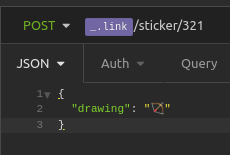

# Fireship RESTful-API
[Fireship Beyond 100 secs - Build an API from Scratch with Node.js Express](https://youtu.be/-MTSQjw5DrM)
- Build a simple REST API
- Learn about middleware
- API gateways
- Debugging with insomnia

## Project done

### Request

### Response

